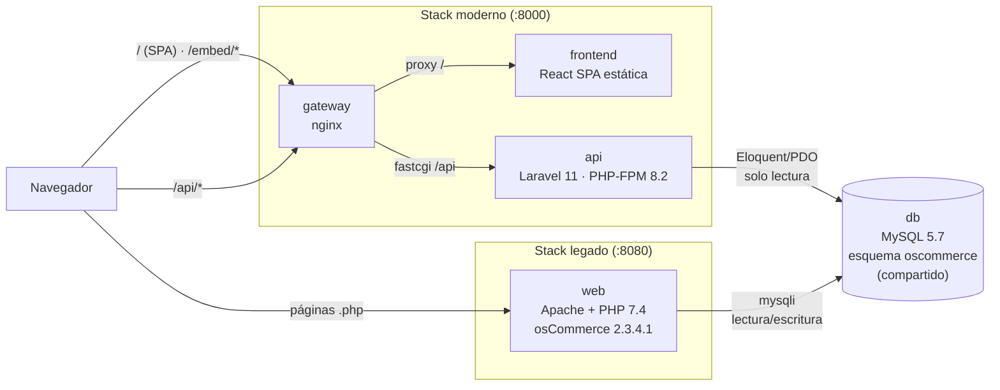
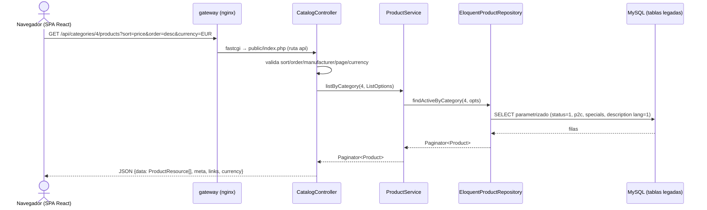
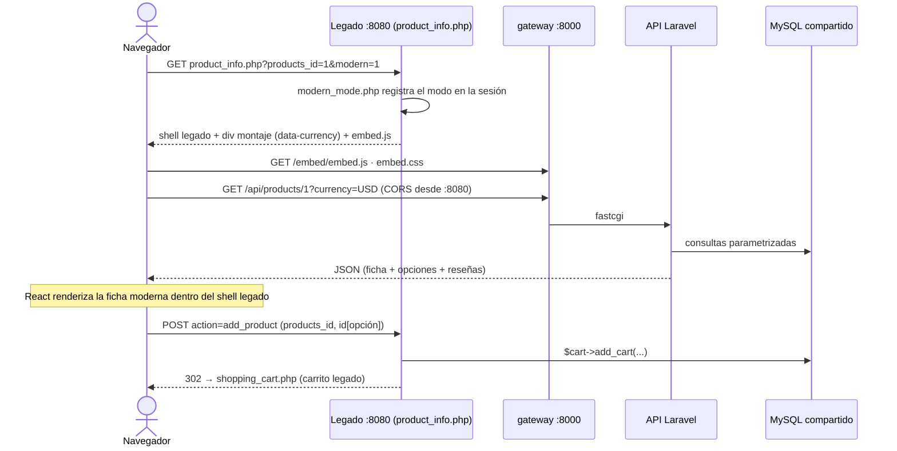
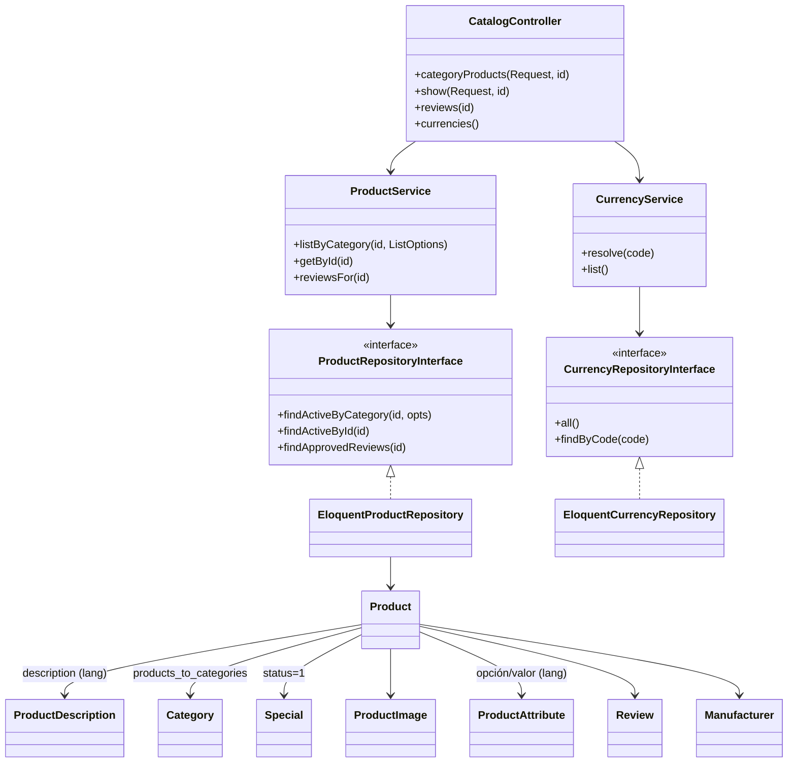

# Arquitectura del pre-experimento — cómo conviven el legado y lo modernizado

Pre-experimento de modernización · osCommerce v2.3.4.1 → Laravel 11 + React

Este documento explica la infraestructura del experimento y **todos los puntos
de contacto** entre la aplicación legada y la modernizada. Complementa al
[README](../README.md) (cómo ejecutar) y a la
[matriz de paridad](parity-matrix.md) (qué se replicó y qué no).

## 1. Vista de contenedores

Ambas aplicaciones corren en el mismo host con Docker Compose y comparten una
única base de datos MySQL. El navegador puede consumir cualquiera de las dos
experiencias — o la híbrida (strangler), donde la página legada incrusta los
componentes modernos.

Puertos: legado `:8080`, moderno `:8000` (SPA + API), phpMyAdmin `:8082`,
MySQL expuesto en `:3307`. La base se siembra sola en el primer arranque
(`catalog/install/oscommerce.sql` + `docker/extra-reviews.sql` vía
`docker-entrypoint-initdb.d`, con cliente forzado a utf8).

## 2. Puntos de contacto entre las dos aplicaciones

| # | Punto de contacto | Dirección | Mecanismo |
|---|---|---|---|
| 1 | **Base de datos compartida** | ambas ↔ MySQL | La API moderna mapea las tablas legadas con Eloquent **en solo lectura** (sin migraciones, sin tablas propias: sesión `array`, caché `file`). El legado sigue leyendo/escribiendo con `mysqli`. |
| 2 | **Embed strangler** | legado → moderno | Las páginas `index.php` y `product_info.php`, en modo moderno, emiten un `
` de montaje + `<script src=":8000/embed/embed.js">`. React se monta dentro del shell legado y consume la API. |
| 3 | **CORS** | navegador → API | El embed corre en el origen `:8080` y llama a `:8000/api/*`; `config/cors.php` autoriza ese origen (solo GET). |
| 4 | **Modo moderno persistente** | legado (sesión) | `catalog/includes/modern_mode.php` guarda la elección en la **sesión osCommerce** (mismo patrón que `currency`/`language`): `?modern=1` activa, `?modern=0` desactiva, y cada página ofrece el enlace de cambio. |
| 5 | **Moneda de sesión** | legado → embed → API | El gate imprime `data-currency="$currency"` (moneda de la sesión legada); el embed la reenvía como `?currency=` y la API convierte con la tabla `currencies`. |
| 6 | **Carrito legado** | moderno → legado | El CTA del embed envía el mismo `POST action=add_product` (con `id[opción]`) que el formulario legado; osCommerce agrega al carrito y continúa a `shopping_cart.php`. El carrito/checkout siguen siendo 100 % legados. |
| 7 | **Imágenes** | moderno → legado | La API devuelve la ruta relativa almacenada; el cliente la resuelve contra `:8080/images/` (el tier web legado sigue sirviendo los assets). |

## 3. Secuencia — R1 en la SPA (arquitectura destino pura)

La separación Controlador → Servicio → Repositorio (interfaz) → Modelos es la
táctica de modificabilidad del diseño destino: la implementación de acceso a
datos puede sustituirse y el servicio se prueba sin base de datos.

## 4. Secuencia — modo strangler (híbrido dentro del legado)

La navegación posterior ya no necesita `?modern=1`: el flag vive en la sesión
osCommerce hasta que el usuario vuelve a la versión clásica.

## 5. Clases — componente Catálogo (API)

## 6. Decisiones que mantienen a salvo al legado

- **La API nunca escribe**: todos los modelos son de solo lectura y el
  contador `products_viewed` se descarta deliberadamente (GET sin efectos).
- **Cero tablas nuevas** en el esquema compartido: Laravel usa sesión `array`
  y caché en archivo; no se ejecutan migraciones.
- **Gates reversibles**: sin el modo moderno en sesión, las páginas legadas
  son idénticas al original (verificado en la compuerta de paridad
  `scripts/parity-check.sh`, que compara SQL legado vs API sobre la misma
  base).
- **Rollout real**: en producción esta segmentación se movería al borde
  (cookie + routing en el gateway) para habilitar cohortes y rollback
  instantáneo; la sesión osCommerce es su equivalente dentro del alcance del
  pre-experimento.
