# Entrega 1 — Escenario de Modernización

**Curso:** Modernización de Software
**Fecha:** Junio de 2026
**Equipo:** _[completar con los nombres de los integrantes]_
**Aplicación seleccionada:** osCommerce Online Merchant v2.3.4.1
**Tecnología origen:** PHP "clásico" estilo LAMP (era PHP 4 / PHP 5 temprano), sin framework, sin MVC

---

## 1. Motivación

El comercio electrónico es uno de los dominios donde existen más sistemas heredados todavía en producción. Durante los años 2000–2010 muchas tiendas online se construyeron sobre **PHP procedural clásico**: archivos `.php` ejecutados directamente por Apache + `mod_php`, con SQL incrustado en el HTML, configuración global vía `register_globals`, y prácticamente ninguna separación entre presentación, lógica de negocio y acceso a datos. Estos sistemas funcionaron durante años, pero hoy presentan problemas serios:

- **Riesgo de seguridad.** Las prácticas idiomáticas de la época (consultas SQL armadas por concatenación, dependencia de `register_globals`, sesiones débiles, falta de escapado consistente en la salida HTML) entran en conflicto frontal con OWASP Top 10 y exponen a las tiendas a inyección SQL y XSS reflejado.
- **Costo creciente de mantenimiento.** La duplicación de lógica entre archivos (cada `producto.php`, `categoria.php`, etc. repite el bootstrap, las consultas y el armado de HTML) hace que cualquier cambio de regla de negocio requiera modificar decenas de archivos.
- **Imposibilidad de evolucionar la infraestructura.** Las versiones modernas de PHP (8.x) eliminaron muchas de las funciones de las que dependen estos sistemas (`each()`, `create_function()`, las superglobales `$HTTP_*_VARS`, `mysql_*`, `register_globals`). Estos sistemas no pueden ejecutarse sobre PHP 8.x sin cambios significativos.
- **Imposibilidad de aplicar prácticas modernas de ingeniería.** No hay capa de pruebas porque la lógica no es testeable (depende de variables globales, estado de sesión, y produce HTML directamente). No hay separación que permita una API REST. No hay forma limpia de integrar un frontend moderno (React, Vue, etc.).

El escenario que vamos a abordar es la modernización de una aplicación PHP heredada hacia una arquitectura por capas con separación clara entre presentación, dominio y acceso a datos. La aplicación de ejemplo es **osCommerce v2.3.4.1**, lanzada en agosto de 2017 como la última versión de la línea 2.3 antes de que el proyecto se reescribiera por completo en la línea 2.4 (que introduce namespaces, *prepared statements*, autoload PSR-4 y un motor de templates). Esto convierte a osCommerce en un caso de estudio especialmente bueno: el mismo proyecto, hecho por el mismo equipo, evolucionó de tecnología legada a tecnología moderna, y ambas versiones existen, son ejecutables, y se pueden comparar lado a lado.

---

## 2. Entendimiento del legado

### 2.1 Tecnología legada

La tecnología origen es el modelo de aplicación PHP conocido informalmente como **"page-script PHP"** o **"PHP clásico"**, que dominó la web entre 1998 y aproximadamente 2010. Sus características principales son:

| Característica | Descripción |
|---|---|
| **Modelo de ejecución page-script** | Cada URL pública corresponde directamente a un archivo `.php` físico en el filesystem (`/producto.php`, `/carrito.php`, `/checkout.php`). Apache resuelve la URL al archivo, lo pasa al intérprete PHP, y devuelve la salida. No hay *front controller* ni enrutador. |
| **Bootstrap por inclusión** | Cada script comienza con `require('includes/application_top.php')`, un archivo monolítico que inicializa configuración, conexión a BD, sesión, idioma, moneda, carrito de compras y manejo de acciones. Es el equivalente funcional —no estructural— a un middleware pipeline. |
| **`register_globals` y `$HTTP_*_VARS`** | Antes de PHP 4.1 las variables de la request (`$_GET`, `$_POST`, `$_COOKIE`) se llamaban `$HTTP_GET_VARS`, `$HTTP_POST_VARS`, `$HTTP_COOKIE_VARS`. Con la directiva `register_globals = On`, además se inyectaban automáticamente como variables globales: `?id=5` hacía aparecer `$id = 5` en el scope global. Esta característica fue declarada insegura y eliminada definitivamente en PHP 5.4. |
| **SQL embebido en HTML** | Las consultas se construyen como strings PHP por concatenación, se ejecutan con `mysql_query()` o `mysqli_query()`, y el bucle de filas se intercala directamente con etiquetas HTML (`<tr>`, `<td>`). No hay capa de mapeo objeto-relacional, no hay *prepared statements*, no hay parametrización: la sanitización depende de llamar manualmente a `mysql_real_escape_string()` o casteo explícito. |
| **Ausencia de MVC** | No existe distinción entre modelo, vista y controlador. El mismo archivo `producto.php` ejecuta la consulta, calcula la lógica de descuentos, decide qué mostrar, y emite el HTML resultante. La "vista" es PHP entremezclado con HTML usando `<?= ?>` o `<?php echo ?>`. |
| **Programación procedural con clases como agrupadores** | Aunque existe la palabra clave `class`, en la práctica se usa como mecanismo de namespacing para funciones relacionadas (clase `currencies`, clase `shopping_cart`). No hay herencia significativa, no hay polimorfismo, no hay inyección de dependencias: las clases se instancian explícitamente en el bootstrap y se acceden vía variable global. |
| **Funciones globales `tep_*`** | El proyecto adopta un prefijo de espacio de nombres por convención (`tep_db_query`, `tep_session_start`, `tep_href_link`, `tep_get_products_name`). Decenas de funciones globales agrupadas en `includes/functions/*.php` cumplen el rol que hoy ocuparían servicios o repositorios. |
| **Configuración por `define()`** | Las claves de configuración (rutas, credenciales de BD, nombres de tablas, textos de UI) se exponen como constantes globales definidas con `define('CONST', 'valor')`. El instalador escribe el archivo `configure.php`. La i18n se implementa cargando un archivo PHP por idioma que define constantes con los textos. |
| **Sesiones nativas PHP** | El estado conversacional (usuario logueado, carrito, idioma activo, moneda activa) vive en `$_SESSION`. Opcionalmente, las sesiones se persisten en BD usando un *save handler* personalizado. |
| **Despliegue Apache + mod_php** | Una sola unidad de despliegue: el árbol de archivos PHP se copia a `DocumentRoot` de Apache. No hay proceso de build, no hay compilación, no hay servidor de aplicación. Apache + `mod_php` (o más adelante `PHP-FPM`) interpretan los archivos en cada request. |

### 2.2 Arquitectura de la tecnología legada

Lo que sigue describe la arquitectura **del modelo de programación**, no de la aplicación particular. Cualquier sistema construido sobre PHP clásico encaja en este esquema.

#### 2.2.1 Diagrama de la arquitectura

```mermaid
flowchart TB
    subgraph Cliente
        Browser[Navegador del usuario]
    end

    subgraph Servidor["Servidor Apache + mod_php"]
        Apache[Apache HTTP Server]

        subgraph Scripts["Capa de página (page-scripts)"]
            P1[producto.php]
            P2[carrito.php]
            P3[checkout.php]
            P4[admin/orders.php]
            Pn[... un archivo por URL ...]
        end

        subgraph Bootstrap["Bootstrap compartido (include)"]
            AT[application_top.php]
            CFG[configure.php<br/>define&#40;&#41; constants]
            FN[functions/*.php<br/>tep_* helpers]
            CLS[classes/*.php<br/>shopping_cart, currencies, order]
            LANG[languages/&lt;lang&gt;/*.php<br/>i18n via define&#40;&#41;]
        end

        SESS[(Sesión PHP<br/>$_SESSION)]
    end

    subgraph Datos
        DB[(MySQL<br/>acceso vía mysqli_*<br/>SQL concatenado)]
        FS[(Filesystem<br/>uploads, imágenes,<br/>configuración escrita)]
    end

    Browser -->|HTTP request URL = archivo| Apache
    Apache -->|invoca .php| P1
    Apache -->|invoca .php| P2
    Apache -->|invoca .php| P3
    Apache -->|invoca .php| P4

    P1 -.require.-> AT
    P2 -.require.-> AT
    P3 -.require.-> AT
    P4 -.require.-> AT

    AT --> CFG
    AT --> FN
    AT --> CLS
    AT --> LANG
    AT --> SESS

    P1 -->|tep_db_query<br/>SQL embebido en HTML| DB
    P2 -->|tep_db_query| DB
    P3 -->|tep_db_query| DB
    P4 -->|tep_db_query| DB

    P1 -->|HTML directo<br/>echo / <?= ?>| Browser
    P2 -->|HTML directo| Browser
    P3 -->|HTML directo| Browser
    P4 -->|HTML directo| Browser

    P3 --> FS
    P4 --> FS
```



#### 2.2.2 Elementos estructurales y sus relaciones

- **Capa de página (page-scripts)**. Es el punto de entrada. Cada archivo `.php` es a la vez controlador, modelo y vista. Recibe la request (a través de `$_GET`/`$_POST` o sus alias `$HTTP_*_VARS`), decide qué hacer, consulta la base de datos, y emite HTML. No existe ningún despachador previo: el mapping URL → archivo lo hace el filesystem de Apache.

- **Bootstrap compartido**. Es un *include* monolítico (`application_top.php`) que todos los page-scripts cargan como primera línea. Inicializa el estado global de la aplicación: parsea la configuración, abre la conexión a MySQL, arranca la sesión, resuelve el idioma y moneda activos, instancia las clases globales (carrito, navegación, etc.), y procesa "acciones" implícitas como `?action=add_product`. Su rol es análogo al pipeline de middleware en frameworks modernos, pero está implementado como un único archivo lineal de cientos de líneas.

- **Funciones helper `tep_*`**. Constituyen la "biblioteca interna" del proyecto, agrupadas en `includes/functions/`. Cubren acceso a BD (`tep_db_query`, `tep_db_fetch_array`), generación de URLs y formularios (`tep_href_link`, `tep_draw_form`), manejo de sesión (`tep_session_*`), validaciones, formateo de precios, etc. Funcionan como servicios globales: cualquier script las llama directamente, sin instanciación.

- **Clases como agrupadores**. PHP introdujo `class` en la versión 4, pero su uso aquí es esencialmente sintáctico: agrupar variables y funciones relacionadas en un objeto que se instancia una vez en el bootstrap y se accede como variable global (`$cart`, `$currencies`, `$breadcrumb`). No hay polimorfismo, no hay herencia significativa, no hay inversión de control. La modularidad existe, pero a nivel léxico, no arquitectónico.

- **Configuración por constantes globales**. `configure.php` define cientos de constantes con `define()` —rutas, credenciales, nombres de tabla, textos. Estas constantes están disponibles globalmente en todos los scripts. La internacionalización es una variante del mismo patrón: el archivo del idioma activo se `require`a y define constantes con los textos traducidos.

- **Capa de datos: SQL crudo**. No hay ORM ni *query builder*. El código construye strings SQL por concatenación e interpolación, los pasa a `tep_db_query()` (una *thin wrapper* sobre `mysqli_query`), itera el resultado con `tep_db_fetch_array()`, y emite el HTML correspondiente. La sanitización es responsabilidad del programador: casteo `(int)` para enteros, llamada manual a `tep_db_input()` para strings. Cualquier omisión es una inyección SQL.

- **Sesión PHP nativa**. Estado conversacional (login, carrito, idioma) persiste en `$_SESSION`. Es posible reemplazar el *save handler* por uno basado en BD para soportar múltiples servidores web sin sesiones compartidas en filesystem.

- **Despliegue como filesystem**. La unidad de despliegue es un árbol de archivos. No hay artefacto compilado, no hay versionado de assets, no hay separación entre código y configuración: el archivo `configure.php` con las credenciales vive dentro del mismo árbol del código fuente.

#### 2.2.3 Consecuencias de esta arquitectura

- **Acoplamiento extremo entre capas.** Una consulta SQL, una decisión de negocio, y la etiqueta `<tr>` que la muestra coexisten en líneas adyacentes. Modificar el modelo de datos implica encontrar todos los archivos donde aparece su SQL.
- **Estado global ubicuo.** Sesión, conexión a BD, configuración, idioma, carrito: todo accesible globalmente desde cualquier punto. No hay manera de instanciar el sistema en modo *test* sin un servidor HTTP real.
- **Cero pruebas automáticas.** La estructura no permite unit testing porque toda función depende de estado global. La única forma de probar la aplicación es ejecutarla en un servidor y simular requests HTTP.
- **Imposibilidad de evolucionar componentes en aislamiento.** No se puede reemplazar la capa de presentación porque está incrustada en los mismos archivos que la lógica de negocio. No se puede exponer la lógica como API REST porque la lógica produce HTML directamente.

### 2.3 Aplicación de ejemplo

#### 2.3.1 Descripción

**osCommerce Online Merchant v2.3.4.1** es una plataforma de comercio electrónico open source escrita en PHP procedural clásico. La versión seleccionada fue liberada el 18 de agosto de 2017 y representa la última iteración de la línea 2.3 antes del rediseño completo realizado en la línea 2.4 (que introduce namespaces, PSR-4, *prepared statements* y un motor de templates).

Esta versión es ideal como caso de estudio porque:

1. **Es genuinamente legada.** Conserva todos los rasgos de la era: `register_globals`, `$HTTP_GET_VARS`, SQL embebido en HTML, ausencia de MVC, funciones `tep_*` globales, bootstrap por `require`.
2. **Compila y ejecuta sobre un stack moderno.** Recibió parches mínimos de compatibilidad con PHP 7.x, lo que permite levantarla sobre Docker con PHP 7.4 + Apache + MySQL 5.7 y verificar funcionalmente todos los flujos.
3. **Tiene una contraparte modernizada en el mismo repositorio.** La versión 2.4 (rama `24` del mismo repo) implementa el mismo dominio funcional con arquitectura moderna. Esto permite comparar antes/después con el mismo *ground truth* funcional.
4. **Es ampliamente conocida.** osCommerce fue una de las plataformas de e-commerce open source más populares de los 2000s, con decenas de miles de instalaciones documentadas.

#### 2.3.2 Métricas de tamaño

| Métrica | Valor |
|---|---|
| Archivos `.php` totales | 702 |
| Líneas de código PHP (`catalog/` completo) | **86 693** |
| Líneas en page-scripts de storefront (`catalog/*.php`) | 7 114 |
| Líneas en page-scripts de admin (`catalog/admin/*.php`) | 11 134 |
| Líneas en `includes/` (clases, funciones, módulos) | 48 126 |
| Módulos de pago integrados | 50+ |
| Módulos de envío integrados | 5 |
| Tablas MySQL | ~50 |

El tamaño excede holgadamente el mínimo de 2 000 LOC establecido por la rúbrica.

#### 2.3.3 Funcionalidades principales

**Storefront (cliente final)**

- Catálogo navegable con categorías y subcategorías de profundidad arbitraria
- Página de detalle de producto con imágenes, atributos (talla, color, etc.), modelo y stock
- Búsqueda básica y avanzada (por categoría, fabricante, rango de precio, fecha)
- Listado de productos nuevos, productos en oferta (specials), productos por fabricante
- Carrito de compras con actualización de cantidades y selección de atributos
- Checkout en 4 pasos: dirección de envío → método de envío → método de pago → confirmación
- Soporte tanto para checkout invitado como con cuenta registrada
- Registro de cuenta con confirmación, login/logout, recuperación de contraseña por token
- Dashboard de cuenta: editar datos personales, cambiar contraseña, libreta de direcciones múltiples
- Historial de pedidos con detalle por orden
- Suscripción a newsletter y a notificaciones de producto
- Reseñas de producto con puntuación por estrellas
- Páginas de contenido estático configurables (privacidad, términos, envíos, cookies)
- Entrega de productos digitales con límite de descargas y vigencia temporal
- Soporte multi-idioma y multi-moneda con conmutador en vivo y tasas de cambio

**Panel de administración**

- ABM de categorías, productos y atributos
- Gestión de fabricantes
- Moderación de reseñas
- Gestión de productos en oferta y productos esperados
- ABM de clientes y pedidos, con flujo de estados configurable
- Generación de facturas y *packing slips* imprimibles
- Localización: países, zonas/estados, *geo zones* compuestas, idiomas con editor por clave, monedas con tipos de cambio, clases e índices de impuestos
- Marketing: banner manager con rotación, programación e impresiones/clicks; *newsletter composer*; envío masivo de correos; logo de la tienda
- Sistema de módulos extensibles para pagos, envíos, *order totals*, cajas laterales (boxes) y dashboard widgets
- Configuración agrupada por categorías (Store, Min/Max Values, Images, Customer Details, Shipping, Stock, Logging, Cache, Email, Download, GZip, Sessions)
- Backup y restauración de base de datos
- Cache management, server info, version check, *who's online*
- Multi-administrador con login independiente
- *Action recorder* (auditoría de acciones administrativas y de cliente)
- *Security checks* sobre permisos de directorios
- Reportes: productos vistos, productos comprados, pedidos por cliente

**Módulos de pago integrados** (selección representativa)

- Cash on delivery, *money order*
- PayPal (Standard, Express Checkout, Pro DP, Pro Hosted, Payflow DP/EC)
- Authorize.net (AIM, SIM, DPM)
- Braintree, Stripe, Sage Pay (Direct/Form/Server), 2Checkout
- Moneybookers/Skrill con más de 20 variantes por país y método

**Módulos de envío**: tarifa plana, por ítem, por tabla peso/precio, USPS real-time, por zonas.

#### 2.3.4 Repositorio

- **Upstream:** [https://github.com/osCommerce/oscommerce2](https://github.com/osCommerce/oscommerce2) (público, MIT-like license)
- **Tag específico:** [`v2.3.4.1`](https://github.com/osCommerce/oscommerce2/releases/tag/v2.3.4.1)
- **Rama de trabajo del equipo:** `course/v2.3.4.1` (creada a partir del tag `v2.3.4.1`, con `Dockerfile` y `docker-compose.yml` añadidos para reproducibilidad)

> _Nota: el repositorio del equipo será un fork del upstream, configurado como público y compartido con la cuenta GitHub `modernizacionsoft`. URL del fork por confirmar cuando se publique._

#### 2.3.5 Ejecución y verificación funcional

La aplicación ha sido configurada para ejecutarse de forma reproducible mediante Docker Compose. El stack consta de:

- **web:** PHP 7.4 + Apache 2.4 + extensiones `mysqli`, `gd`, `zip`, `curl`, con `mod_rewrite` habilitado
- **db:** MySQL 5.7 (imagen oficial, forzada a `linux/amd64` para compatibilidad con Apple Silicon vía emulación Rosetta)
- **phpmyadmin:** interfaz web para inspección directa de la base de datos durante el trabajo del curso

Pasos para levantar el entorno:

```bash
git checkout course/v2.3.4.1
docker compose up -d --build
# Storefront:  http://localhost:8080/
# Admin:       http://localhost:8080/admin/
# Installer:   http://localhost:8080/install/
# phpMyAdmin:  http://localhost:8081/  (root/root)
```

El instalador web confirma el cumplimiento de los requisitos del entorno (PHP, `register_globals`, MySQLi, GD, permisos) y permite poblar la base de datos con un catálogo de muestra para verificar todos los flujos funcionales (navegación, carrito, checkout, administración).

#### 2.3.6 Familiaridad del equipo con la tecnología

_[Completar con la justificación específica del equipo: experiencia previa de los integrantes con PHP clásico, mantenimiento de aplicaciones LAMP heredadas, etc.]_

---

## Anexo: criterios de selección

Esta aplicación cumple las recomendaciones de la rúbrica:

| Criterio | Cumplimiento |
|---|---|
| Tamaño mínimo de 2 000 LOC | 86 693 LOC en PHP (>40× el mínimo) |
| Código familiar a al menos un integrante | _[justificar por equipo]_ |
| La aplicación se puede ejecutar para probar funcionalidades | Sí, vía `docker compose up`; instalador web verificado funcional |
| Código completo (compila/ejecuta) | Sí, el tag `v2.3.4.1` es una release oficial estable |
| Tecnología origen genuinamente legada | Sí: PHP procedural pre-MVC con `register_globals`, `$HTTP_*_VARS`, SQL embebido, ~15 años de antigüedad arquitectónica |
| Existe un *target* claro de modernización | Sí: la propia v2.4 del mismo proyecto, con namespaces, *prepared statements*, autoload PSR-4 y motor de templates, sirve como referencia |
