# Entrega 1 — Escenario de Modernización

**Curso:** Modernización de Software
**Fecha:** Junio de 2026
**Equipo:** _[completar con los nombres de los integrantes]_
**Aplicación seleccionada:** osCommerce Online Merchant v2.3.4.1
**Tecnología origen:** PHP "clásico" estilo LAMP (era PHP 4 / PHP 5 temprano), sin framework, sin MVC

---

## 1. Motivación

El comercio electrónico es uno de los dominios donde existen más sistemas heredados todavía en producción. Durante los años 2000–2010 muchas tiendas online se construyeron sobre **PHP procedural clásico**: archivos `.php` ejecutados directamente por Apache + `mod_php`, con SQL incrustado en el HTML, configuración global vía `register_globals`, y prácticamente ninguna separación entre presentación, lógica de negocio y acceso a datos. Estos sistemas funcionaron durante años, pero hoy presentan problemas serios:

- **Riesgo de seguridad.** Las prácticas idiomáticas de la época (consultas SQL armadas por concatenación, dependencia de `register_globals`, sesiones débiles, falta de escapado consistente en la salida HTML) entran en conflicto frontal con OWASP Top 10 y exponen a las tiendas a inyección SQL y XSS reflejado.
- **Costo creciente de mantenimiento.** La duplicación de lógica entre archivos (cada `producto.php`, `categoria.php`, etc. repite el bootstrap, las consultas y el armado de HTML) hace que cualquier cambio de regla de negocio requiera modificar decenas de archivos.
- **Imposibilidad de evolucionar la infraestructura.** Las versiones modernas de PHP (8.x) eliminaron muchas de las funciones de las que dependen estos sistemas (`each()`, `create_function()`, las superglobales `$HTTP_*_VARS`, `mysql_*`, `register_globals`). Estos sistemas no pueden ejecutarse sobre PHP 8.x sin cambios significativos.
- **Imposibilidad de aplicar prácticas modernas de ingeniería.** No hay capa de pruebas porque la lógica no es testeable (depende de variables globales, estado de sesión, y produce HTML directamente). No hay separación que permita una API REST. No hay forma limpia de integrar un frontend moderno (React, Vue, etc.).

El escenario que vamos a abordar es la modernización de una aplicación PHP heredada hacia una arquitectura por capas con separación clara entre presentación, dominio y acceso a datos. La aplicación de ejemplo es **osCommerce v2.3.4.1**, lanzada en agosto de 2017 como la última versión de la línea 2.3 antes de que el proyecto se reescribiera por completo en la línea 2.4 (que introduce namespaces, *prepared statements*, autoload PSR-4 y un motor de templates). Esto convierte a osCommerce en un caso de estudio especialmente bueno: el mismo proyecto, hecho por el mismo equipo, evolucionó de tecnología legada a tecnología moderna, y ambas versiones existen, son ejecutables, y se pueden comparar lado a lado.

---

## 2. Entendimiento del legado

### 2.1 Tecnología legada

La tecnología origen es el modelo de aplicación PHP conocido informalmente como **"page-script PHP"** o **"PHP clásico"**, que dominó la web entre 1998 y aproximadamente 2010. Sus características principales son:

| Característica | Descripción |
|---|---|
| **Modelo de ejecución page-script** | Cada URL pública corresponde directamente a un archivo `.php` físico en el filesystem. El servidor web resuelve la URL al archivo, lo pasa al intérprete PHP, y devuelve la salida. No hay *front controller* ni enrutador: el *routing* lo realiza el filesystem. |
| **Bootstrap por inclusión** | Cada script comienza con un `require`/`include` de un archivo monolítico que inicializa el estado global del request (configuración, conexión a BD, sesión, locale, objetos globales, despacho de acciones). Es el equivalente funcional —no estructural— a un pipeline de middleware. |
| **`register_globals` y `$HTTP_*_VARS`** | Antes de PHP 4.1 las variables de la request (`$_GET`, `$_POST`, `$_COOKIE`) se llamaban `$HTTP_GET_VARS`, `$HTTP_POST_VARS`, `$HTTP_COOKIE_VARS`. Con la directiva `register_globals = On`, además se inyectaban automáticamente como variables globales: `?id=5` hacía aparecer `$id = 5` en el scope global. Esta característica fue declarada insegura y eliminada definitivamente en PHP 5.4. |
| **SQL embebido en HTML** | Las consultas se construyen como strings PHP por concatenación, se ejecutan con el driver crudo del RDBMS (`mysql_query()` o `mysqli_query()`), y el bucle de filas se intercala directamente con etiquetas HTML (`<tr>`, `<td>`). No hay capa de mapeo objeto-relacional, no hay *prepared statements*, no hay parametrización: la sanitización depende de llamar manualmente a `mysql_real_escape_string()` o casteo explícito. |
| **Ausencia de MVC** | No existe distinción entre modelo, vista y controlador. El mismo archivo `.php` ejecuta las consultas, calcula la lógica de negocio, decide qué mostrar, y emite el HTML resultante. La "vista" es PHP entremezclado con HTML usando `<?= ?>` o `<?php echo ?>`. |
| **Programación procedural con clases como agrupadores** | Aunque existe la palabra clave `class`, en la práctica se usa como mecanismo de namespacing para funciones relacionadas. No hay herencia significativa, no hay polimorfismo, no hay inyección de dependencias: las clases se instancian explícitamente en el bootstrap y se acceden vía variable global. |
| **Funciones helper globales** | Es idiomático que los proyectos definan una "biblioteca interna" de decenas o cientos de funciones globales (típicamente con un prefijo de namespace por convención) que cubren acceso a BD, generación de URLs y formularios, manejo de sesión, validación, formateo. Cualquier page-script las invoca directamente. Cumplen el rol que en arquitecturas modernas ocuparían servicios y repositorios. |
| **Configuración por `define()`** | Las claves de configuración (rutas, credenciales de BD, nombres de tablas, textos de UI) se exponen como constantes globales definidas con `define('CONST', 'valor')`. La i18n se implementa cargando un archivo PHP por idioma que define constantes con los textos traducidos. |
| **Sesiones nativas PHP** | El estado conversacional del usuario (login, preferencias, datos transitorios) vive en `$_SESSION`. Opcionalmente, las sesiones se persisten en BD usando un *save handler* personalizado. |
| **Despliegue Apache + mod_php** | Una sola unidad de despliegue: el árbol de archivos PHP se copia a `DocumentRoot` del servidor web. No hay proceso de build, no hay compilación, no hay servidor de aplicación. Apache + `mod_php` (o más adelante `PHP-FPM`) interpretan los archivos en cada request. |

### 2.2 Arquitectura de la tecnología legada

> **Nota sobre el alcance de esta sección.** A diferencia de las tecnologías con un *application server* explícito (por ejemplo JEE, que define una arquitectura por capas con capa web, capa EJB, capa de persistencia, etc.), el modelo de PHP clásico no tiene un *framework* de referencia oficial: la arquitectura emerge directamente del modelo de ejecución de PHP + Apache. Lo que sigue describe esa arquitectura **a nivel de paradigma tecnológico** —los elementos estructurales que aparecen en cualquier aplicación construida sobre esta tecnología— y deliberadamente **no hace referencia a archivos, funciones o clases concretas de osCommerce**. La instanciación particular de este modelo en la aplicación de ejemplo se describe en la sección 2.3.

#### 2.2.1 Diagrama de la arquitectura

```mermaid
flowchart TB
    subgraph Cliente["Capa cliente"]
        Browser[Navegador]
    end

    subgraph SAPI["Capa servidor: Apache + mod_php (SAPI)"]
        direction TB
        Apache[Servidor web Apache]
        Interp[Intérprete PHP embebido]
        Apache --- Interp
    end

    subgraph Page["Capa de presentación + lógica (page-scripts)<br/>1 URL ⇒ 1 archivo .php ⇒ controlador + modelo + vista"]
        P1[script_A.php]
        P2[script_B.php]
        Pn["… un archivo .php por cada URL pública …"]
    end

    subgraph Boot["Capa de bootstrap (include compartido)<br/>require'd como primera línea de cada page-script"]
        BS["bootstrap include<br/>inicializa estado global del request"]
    end

    subgraph Servicios["Capa de servicios procedurales"]
        FN["Funciones helper globales<br/>agrupadas por dominio funcional<br/>(BD, sesión, formularios, validación, …)"]
        CLS["Clases-namespace<br/>agrupan funciones afines<br/>(sin polimorfismo ni IoC)"]
    end

    subgraph Conf["Capa de configuración global"]
        CFG["Constantes define&#40;&#41;<br/>rutas, credenciales, parámetros"]
        I18N["Archivos de idioma<br/>i18n vía define&#40;&#41; de constantes"]
    end

    subgraph Estado["Capa de estado conversacional"]
        SESS[(Sesión PHP nativa<br/>$_SESSION)]
    end

    subgraph Datos["Capa de persistencia"]
        DB[(RDBMS<br/>acceso vía driver crudo<br/>mysql_* / mysqli_*<br/>SQL armado por concatenación)]
        FS[(Filesystem<br/>uploads, archivos generados,<br/>configuración escrita)]
    end

    Browser -->|HTTP request<br/>URL = ruta de archivo en disco| Apache
    Apache -->|delega ejecución del .php<br/>al intérprete embebido| P1
    Apache -.->|nuevo proceso/thread<br/>por cada request| P2
    Apache -.-> Pn

    P1 -.require/include.-> BS
    P2 -.require/include.-> BS
    Pn -.require/include.-> BS

    BS --> CFG
    BS --> I18N
    BS --> FN
    BS --> CLS
    BS --> SESS
    BS --> DB

    P1 -->|llamadas directas| FN
    P1 -->|instancia + usa| CLS
    P1 -->|lee constantes| CFG
    P1 -->|lee/escribe| SESS
    P1 -->|SQL crudo embebido<br/>en el flujo HTML| DB
    P1 -->|HTML emitido directamente<br/>echo / &lt;?= ?&gt;| Browser
    P1 --> FS
```



#### 2.2.2 Elementos estructurales y sus relaciones

A continuación se describen los componentes que aparecen en cualquier aplicación construida sobre PHP clásico, su responsabilidad, y la naturaleza de sus relaciones.

- **Capa servidor (Apache + mod_php / SAPI).** El servidor web traduce la URL solicitada en una ruta del filesystem. Si la ruta corresponde a un archivo `.php`, lo entrega al intérprete PHP embebido (el *Server API* o **SAPI** —`mod_php` históricamente, `PHP-FPM` después—) que lo ejecuta y devuelve la salida al cliente. Cada request invoca un proceso o hilo independiente: **no hay estado en memoria entre requests**, todo el estado conversacional se externaliza a sesión o BD.

- **Capa de presentación + lógica (page-scripts).** Es la capa de entrada de la aplicación. Su característica definitoria es la **fusión de los tres roles de MVC en un mismo archivo**: cada `.php` es simultáneamente controlador (decide qué hacer con la request), modelo (consulta directamente la base de datos) y vista (emite HTML mediante `echo` o etiquetas `<?= ?>`). No existe *front controller* ni enrutador: el *mapping* URL → archivo lo realiza el filesystem del servidor web. Las únicas entradas externas son las superglobales `$_GET`, `$_POST`, `$_COOKIE`, `$_SERVER` y —en la era previa a PHP 5.4— sus alias `$HTTP_*_VARS`.

- **Capa de bootstrap (include compartido).** Es un archivo de inicialización que cada page-script debe cargar como primera instrucción mediante `require`/`include`. Su rol funcional es análogo al pipeline de *middleware* de un framework moderno —parsear configuración, abrir la conexión a BD, arrancar la sesión, resolver locale/timezone, instanciar objetos globales, despachar acciones implícitas codificadas en la URL—, pero está implementado como **un único archivo lineal procedural**, no como una cadena composable de componentes. La relación con los page-scripts es de inclusión textual: el código del bootstrap se concatena al inicio de cada script en tiempo de ejecución.

- **Capa de servicios procedurales (funciones helper globales).** Es la "biblioteca interna" de la aplicación: colecciones de funciones globales agrupadas por dominio funcional (acceso a BD, generación de URLs y formularios, manejo de sesión, validación, formateo) y cargadas globalmente por el bootstrap. Cualquier page-script las invoca directamente, sin instanciación ni inyección. Cumplen el rol que en arquitecturas modernas ocuparían los **servicios, repositorios y utilidades**, pero sin contratos explícitos ni reemplazabilidad.

- **Clases como agrupadores léxicos.** PHP introdujo la palabra clave `class` en la versión 4, pero su uso en el paradigma clásico es esencialmente **sintáctico, no arquitectónico**: agrupar variables y funciones relacionadas en un objeto que se instancia una sola vez en el bootstrap y se accede como variable global. No hay herencia significativa, no hay polimorfismo, no hay inversión de control ni inyección de dependencias. Funcionalmente equivalen a *namespaces* manuales sobre la capa de servicios procedurales.

- **Capa de configuración global (constantes `define()`).** Los parámetros de configuración —rutas del filesystem, credenciales de BD, identificadores de servicios externos, textos visibles— se exponen como **constantes globales** declaradas con `define('NOMBRE', valor)`. Estas constantes son inmutables y accesibles desde cualquier punto del código. La internacionalización (i18n) es una variante del mismo patrón: el archivo del idioma activo se `require`a y define constantes con los textos traducidos, que las vistas referencian directamente.

- **Capa de estado conversacional (sesión PHP nativa).** El estado del usuario entre requests (autenticación, preferencias, datos transitorios como un carrito) persiste en la superglobal `$_SESSION`. PHP gestiona la cookie de sesión y la serialización transparentemente. El *save handler* por defecto persiste sesiones como archivos en el filesystem del servidor; puede reemplazarse por un *handler* personalizado (típicamente backed por BD) para soportar despliegue en múltiples servidores.

- **Capa de persistencia (acceso directo al RDBMS).** No existe ORM, *query builder*, ni capa de repositorios. El código de los page-scripts construye consultas SQL como **strings concatenados**, las ejecuta directamente contra el driver del RDBMS (`mysql_query` en la era PHP 4 / `mysqli_query` / `pg_query`...) e itera los resultados intercalándolos con la salida HTML. La sanitización contra inyección SQL es **responsabilidad manual del programador**: casteo explícito de enteros, escapado con funciones del driver, o ambos. No hay *prepared statements* idiomáticos en esta era.

- **Capa de despliegue (filesystem como artefacto).** La unidad de despliegue es el árbol de archivos fuente copiado directamente al `DocumentRoot` del servidor web. **No hay paso de compilación, no hay artefacto binario, no hay versionado de assets, no hay separación entre código y configuración**: el archivo con las credenciales vive dentro del mismo árbol que el código fuente. Una actualización es esencialmente una copia de archivos sobre el servidor.

#### 2.2.3 Consecuencias de esta arquitectura

- **Acoplamiento extremo entre capas.** Una consulta SQL, una decisión de negocio, y la etiqueta `<tr>` que la muestra coexisten en líneas adyacentes. Modificar el modelo de datos implica encontrar todos los archivos donde aparece su SQL.
- **Estado global ubicuo.** Sesión, conexión a BD, configuración, locale, objetos de dominio: todo accesible globalmente desde cualquier punto. No hay manera de instanciar el sistema en modo *test* sin un servidor HTTP real.
- **Cero pruebas automáticas.** La estructura no permite unit testing porque toda función depende de estado global. La única forma de probar la aplicación es ejecutarla en un servidor y simular requests HTTP.
- **Imposibilidad de evolucionar componentes en aislamiento.** No se puede reemplazar la capa de presentación porque está incrustada en los mismos archivos que la lógica de negocio. No se puede exponer la lógica como API REST porque la lógica produce HTML directamente.

### 2.3 Aplicación de ejemplo

#### 2.3.1 Descripción

**osCommerce Online Merchant v2.3.4.1** es una plataforma de comercio electrónico open source escrita en PHP procedural clásico. La versión seleccionada fue liberada el 18 de agosto de 2017 y representa la última iteración de la línea 2.3 antes del rediseño completo realizado en la línea 2.4 (que introduce namespaces, PSR-4, *prepared statements* y un motor de templates).

Esta versión es ideal como caso de estudio porque:

1. **Es genuinamente legada.** Conserva todos los rasgos de la era: `register_globals`, `$HTTP_GET_VARS`, SQL embebido en HTML, ausencia de MVC, funciones `tep_*` globales, bootstrap por `require`.
2. **Compila y ejecuta sobre un stack moderno.** Recibió parches mínimos de compatibilidad con PHP 7.x, lo que permite levantarla sobre Docker con PHP 7.4 + Apache + MySQL 5.7 y verificar funcionalmente todos los flujos.
3. **Tiene una contraparte modernizada en el mismo repositorio.** La versión 2.4 (rama `24` del mismo repo) implementa el mismo dominio funcional con arquitectura moderna. Esto permite comparar antes/después con el mismo *ground truth* funcional.
4. **Es ampliamente conocida.** osCommerce fue una de las plataformas de e-commerce open source más populares de los 2000s, con decenas de miles de instalaciones documentadas.

#### 2.3.2 Métricas de tamaño

| Métrica | Valor |
|---|---|
| Archivos `.php` totales | 702 |
| Líneas de código PHP (`catalog/` completo) | **86 693** |
| Líneas en page-scripts de storefront (`catalog/*.php`) | 7 114 |
| Líneas en page-scripts de admin (`catalog/admin/*.php`) | 11 134 |
| Líneas en `includes/` (clases, funciones, módulos) | 48 126 |
| Módulos de pago integrados | 50+ |
| Módulos de envío integrados | 5 |
| Tablas MySQL | ~50 |

El tamaño excede holgadamente el mínimo de 2 000 LOC establecido por la rúbrica.

#### 2.3.3 Funcionalidades principales

**Storefront (cliente final)**

- Catálogo navegable con categorías y subcategorías de profundidad arbitraria
- Página de detalle de producto con imágenes, atributos (talla, color, etc.), modelo y stock
- Búsqueda básica y avanzada (por categoría, fabricante, rango de precio, fecha)
- Listado de productos nuevos, productos en oferta (specials), productos por fabricante
- Carrito de compras con actualización de cantidades y selección de atributos
- Checkout en 4 pasos: dirección de envío → método de envío → método de pago → confirmación
- Soporte tanto para checkout invitado como con cuenta registrada
- Registro de cuenta con confirmación, login/logout, recuperación de contraseña por token
- Dashboard de cuenta: editar datos personales, cambiar contraseña, libreta de direcciones múltiples
- Historial de pedidos con detalle por orden
- Suscripción a newsletter y a notificaciones de producto
- Reseñas de producto con puntuación por estrellas
- Páginas de contenido estático configurables (privacidad, términos, envíos, cookies)
- Entrega de productos digitales con límite de descargas y vigencia temporal
- Soporte multi-idioma y multi-moneda con conmutador en vivo y tasas de cambio

**Panel de administración**

- ABM de categorías, productos y atributos
- Gestión de fabricantes
- Moderación de reseñas
- Gestión de productos en oferta y productos esperados
- ABM de clientes y pedidos, con flujo de estados configurable
- Generación de facturas y *packing slips* imprimibles
- Localización: países, zonas/estados, *geo zones* compuestas, idiomas con editor por clave, monedas con tipos de cambio, clases e índices de impuestos
- Marketing: banner manager con rotación, programación e impresiones/clicks; *newsletter composer*; envío masivo de correos; logo de la tienda
- Sistema de módulos extensibles para pagos, envíos, *order totals*, cajas laterales (boxes) y dashboard widgets
- Configuración agrupada por categorías (Store, Min/Max Values, Images, Customer Details, Shipping, Stock, Logging, Cache, Email, Download, GZip, Sessions)
- Backup y restauración de base de datos
- Cache management, server info, version check, *who's online*
- Multi-administrador con login independiente
- *Action recorder* (auditoría de acciones administrativas y de cliente)
- *Security checks* sobre permisos de directorios
- Reportes: productos vistos, productos comprados, pedidos por cliente

**Módulos de pago integrados** (selección representativa)

- Cash on delivery, *money order*
- PayPal (Standard, Express Checkout, Pro DP, Pro Hosted, Payflow DP/EC)
- Authorize.net (AIM, SIM, DPM)
- Braintree, Stripe, Sage Pay (Direct/Form/Server), 2Checkout
- Moneybookers/Skrill con más de 20 variantes por país y método

**Módulos de envío**: tarifa plana, por ítem, por tabla peso/precio, USPS real-time, por zonas.

#### 2.3.4 Repositorio

- **Upstream:** [https://github.com/osCommerce/oscommerce2](https://github.com/osCommerce/oscommerce2) (público, MIT-like license)
- **Tag específico:** [`v2.3.4.1`](https://github.com/osCommerce/oscommerce2/releases/tag/v2.3.4.1)
- **Rama de trabajo del equipo:** `course/v2.3.4.1` (creada a partir del tag `v2.3.4.1`, con `Dockerfile` y `docker-compose.yml` añadidos para reproducibilidad)

> _Nota: el repositorio del equipo será un fork del upstream, configurado como público y compartido con la cuenta GitHub `modernizacionsoft`. URL del fork por confirmar cuando se publique._

#### 2.3.5 Ejecución y verificación funcional

La aplicación ha sido configurada para ejecutarse de forma reproducible mediante Docker Compose. El stack consta de:

- **web:** PHP 7.4 + Apache 2.4 + extensiones `mysqli`, `gd`, `zip`, `curl`, con `mod_rewrite` habilitado
- **db:** MySQL 5.7 (imagen oficial, forzada a `linux/amd64` para compatibilidad con Apple Silicon vía emulación Rosetta)
- **phpmyadmin:** interfaz web para inspección directa de la base de datos durante el trabajo del curso

Pasos para levantar el entorno:

```bash
git checkout course/v2.3.4.1
docker compose up -d --build
# Storefront:  http://localhost:8080/
# Admin:       http://localhost:8080/admin/
# Installer:   http://localhost:8080/install/
# phpMyAdmin:  http://localhost:8081/  (root/root)
```

El instalador web confirma el cumplimiento de los requisitos del entorno (PHP, `register_globals`, MySQLi, GD, permisos) y permite poblar la base de datos con un catálogo de muestra para verificar todos los flujos funcionales (navegación, carrito, checkout, administración).

#### 2.3.6 Familiaridad del equipo con la tecnología

_[Completar con la justificación específica del equipo: experiencia previa de los integrantes con PHP clásico, mantenimiento de aplicaciones LAMP heredadas, etc.]_

---

## Anexo: criterios de selección

Esta aplicación cumple las recomendaciones de la rúbrica:

| Criterio | Cumplimiento |
|---|---|
| Tamaño mínimo de 2 000 LOC | 86 693 LOC en PHP (>40× el mínimo) |
| Código familiar a al menos un integrante | _[justificar por equipo]_ |
| La aplicación se puede ejecutar para probar funcionalidades | Sí, vía `docker compose up`; instalador web verificado funcional |
| Código completo (compila/ejecuta) | Sí, el tag `v2.3.4.1` es una release oficial estable |
| Tecnología origen genuinamente legada | Sí: PHP procedural pre-MVC con `register_globals`, `$HTTP_*_VARS`, SQL embebido, ~15 años de antigüedad arquitectónica |
| Existe un *target* claro de modernización | Sí: la propia v2.4 del mismo proyecto, con namespaces, *prepared statements*, autoload PSR-4 y motor de templates, sirve como referencia |
